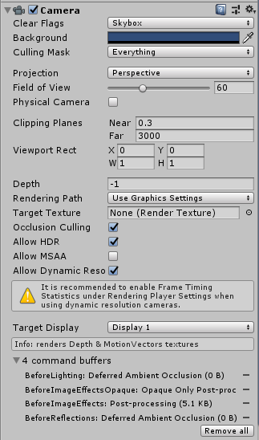
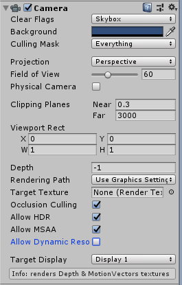
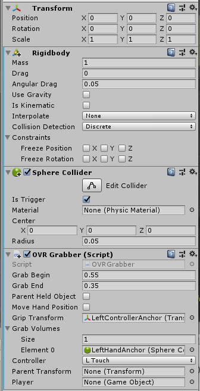
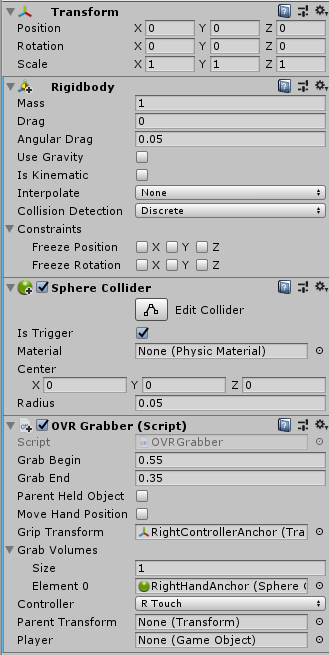

# Importing Car Model and Hands

## Unorganized Notes
### Import Realistic Car
1. Install Unity Standard Assets from the Asset Store

We used [Realistic Car](#) bought from the Unity asset store but any car model can be used, including the standard asset car.

When the main camera is placed into the Realistic Car, the view might appear fuzzy. To fix this, select `remove all` buffers under `Target Display`.
.
.

### Import Hands
1. From the Asset store import the Oculus package
2. Once downloaded, go to `Oculus/VR/Prefabs` and select the OVR Player Controller and place it in the interior of your car model
3. **JUST FOR US PLS EDIT** We found that x=0.7, y=0.85, z = 0.288 are good numbers

4. Go to the tab `Oculus/Avatars/Edit Settings` and put in the Oculus Rift App ID

To find your App ID, go to dashboard.oculus.com and select Getting Started API. It will be listed there

5.Find the Local Avatar prefab in the Oculus folder and drag nder OVR Camera Rig. Open up the local Avator in the inspector and input your Oculus User ID which can be found in the same place as your Rift App ID

6. Check the `LeftHandAnchor` and `RightHandAnchor` to ensure they match up with the settings below

7. The hands should appear in the car. If they don't there is a chance the positioning of the controller might be causing the hands to appear far below or far above your head.

