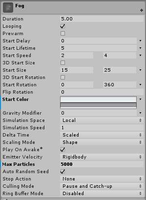
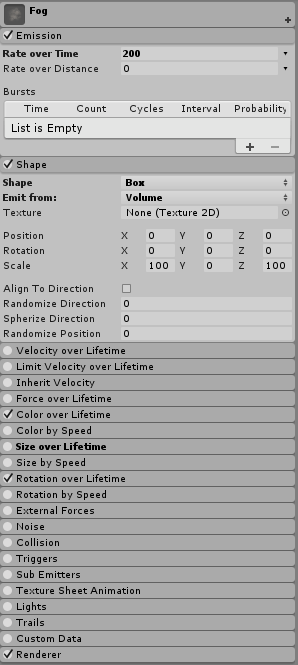
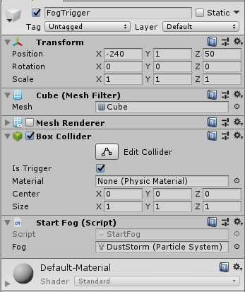

# Weather Control - Fog
## Using Standard Asset Particle System

The Unity Standard Assets package comes with a way to render visual effects using small images, called a particle system. You can read more about particle systems [here](https://docs.unity3d.com/Manual/ParticleSystems.html). A particle system is an efficient way to create the appearance of fog or other weather systems. This documentation will focus on the creation of fog, using the Dust Storm Particle System prefab, but similar effects can be created with a custom Particle System.

### Adapting the DustStorm prefab

1. Confirm the Standard Assets package is imported in the current project.

2. Navigate to the prefabs folder under `Assets > StandardAssets > ParticleSystems > Prefabs` and add `DustStorm.prefab` to your scene.

3. Move the particle system to its desired location in your scene, either using the move tool or changing the transform coordinates at the top of the inspector.

4. In the inspector, change the following settings which are important to convert the dust into fog (settings will become bold as you change them):

#### Useful Settings for adapting prefab to fog

   a. `Start Color`: In the main tab of the Particle System inspector, click the two colored boxes under start color to select an appropriate light and dark range for your fog. The System is automatically set to generate particles with a random color between the two selected, to change this (optional), select the drop down to the right of the color boxes.
   
   b. `Max Particles`: Controls the maximum number of particles in the scene at one time, a factor in the density of the fog. To make the dust storm seem more fog-like, increase this number to the density of fog desired.
   
   c. `Emission > Emission Rate`: Controls how fast/often particles appear, which is another factor in density. Again, increase emission rate to make the particle system seem more fog-like.

   d. `Shape > Shape`: Make sure the box shape is selected.
   
   e. `Size over Lifetime`: This tab controls the size of the particles over the lifetime, with an automatic graph so that particles vary over time. This setting causes a swelling and shrinking effect uncharacteristic of fog and can either be unchecked completely or edited to be more consistent over time.
   
   These settings can be seen in the inspector below: 
   
   
   

#### Optional Settings to personalize fog
   a. `Simulation Speed`: Controls how fast the simulation runs
   
   b. `Play on Awake`: Automatically starts the particle simulation when the scene runs. Turn off to control manually (see below).
   
   c. `Force over Lifetime`: Changing the coordinates under this tab can create the appearance of overall movement, such as the fog blowing from one direction.
   
   d. `Color over Lifetime`: The prefab automatically comes with a graph for the color over lifetime so particles gradually fade in and out. This can be edited to reach the desired effect.

Feel free to play around with other settings, as many interesting effects can be created beyond those mentioned here.

### Trigger a Particle System
As mentioned above, the particle system is set to automatically start running when the scene is played. To trigger a particle system later in the scene, one method is shown below, by making the particle system of a 3D object which can then be activated. This method is designed to trigger the particle system with a collision. The StartFog.cs script can be used to start the fog and the StopFog.cs can be used to stop the fog.

1. Create desired particle system as above.

2. Add a cube to the scene (`GameObject > 3D object > cube`). This will be the trigger for the particle system, so name as appropriate and position where you want the fog to be triggered from (eg. in the path of the car so when the car reaches a certain point, the fog starts).

3. Attach the appropriate script to the fog trigger and drag the fog particle system into the `Fog` box under the script. 

4. Uncheck the `Play On Awake` setting under the Fog Particle System, as described above. 

5. Check the `Is Trigger` box under the `Box Collider` settings of the trigger cube.

6. Once you have confirmed the trigger works, you can uncheck the box next to `Mesh Renderer` under the trigger cube to make the trigger invisible.
   
     
     
Note: StopFog.cs includes 2 ways to stop the fog, either by stopping emission (Stop()) or by immediately clearing all particles (Clear()). The first option creates a more gradual effect, while the second is very abrupt. Either or both can be used as needed by commenting out the other.

